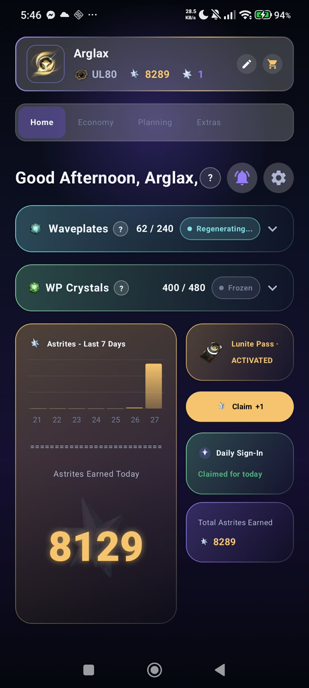
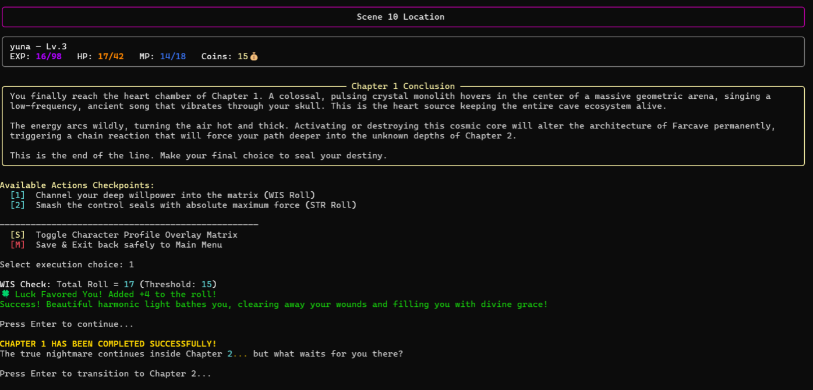
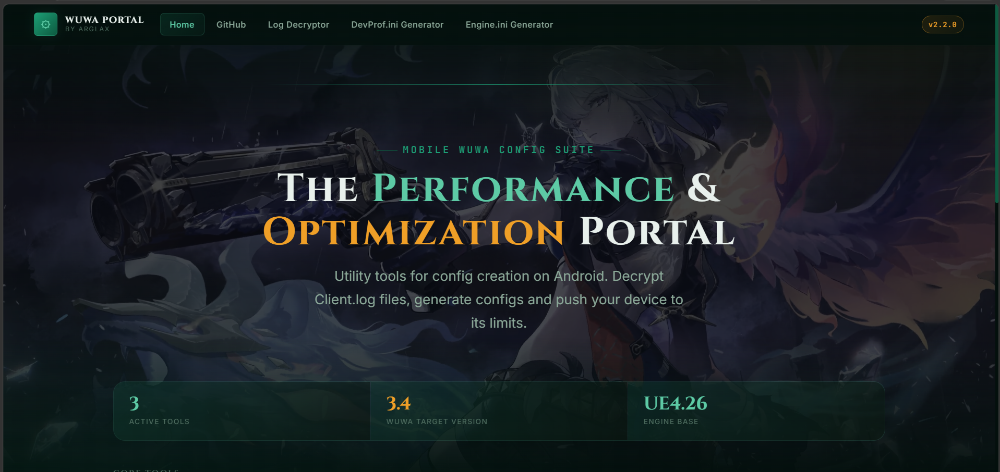
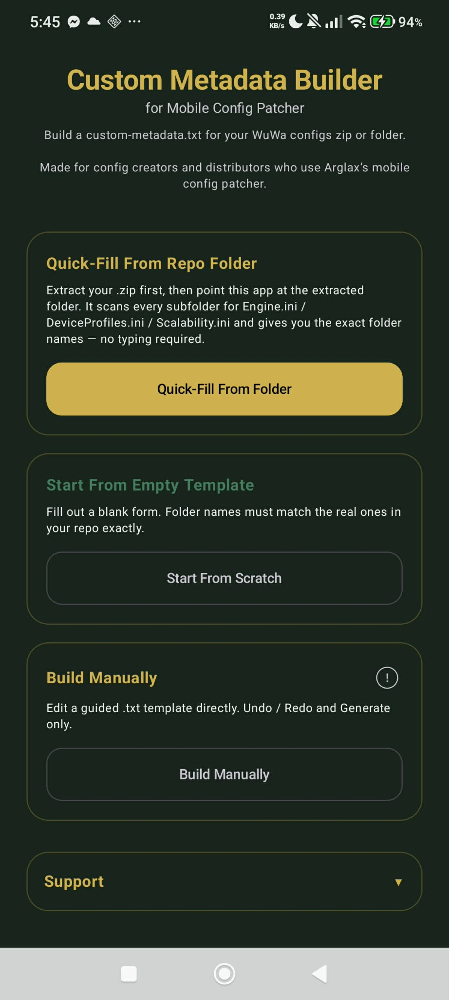
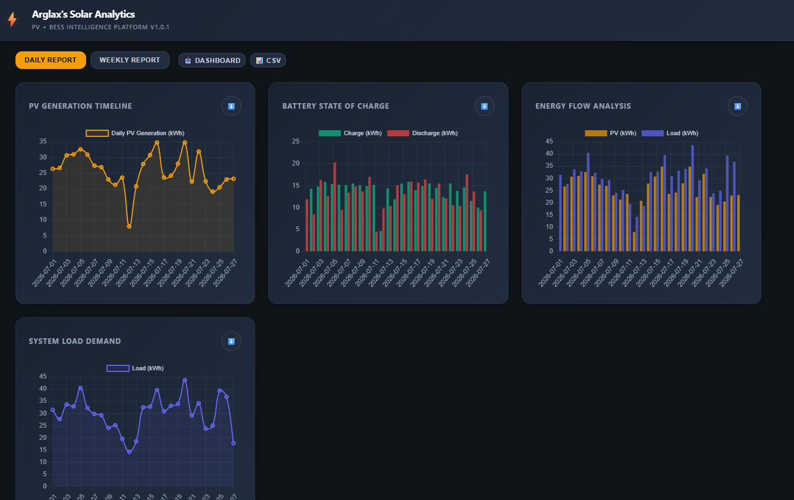

# Hi, I'm Arglax! 👋

  
  

### About Me 

* **Background:** Electrical Engineering with interests in Data Science, Software Development, and AI.
* **Journey:** Mostly self-taught through curiosity, experimentation, and countless hours of learning from the internet.
* **Current Interests:** Data science, game development, automation, and systems programming.
* **Fun Fact:** I enjoy *Dark Souls*. Strength builds. Bonk.
* **Currently Building:**

  * 📱 **[WuWaLab](https://github.com/Arglax/WuWaLab)** – Mobile companion app for *Wuthering Waves* with Astrite logging, income accounting, and pull planning. *(Featured)*
  * **Farcave** – A terminal-first dark fantasy roguelike RPG engine with modular story chapters and permanent consequences.
  * **WuWa-Mobile-Config** – Utility tools, configuration resources, and a lightweight **Config Patcher** app for *Wuthering Waves* mobile players.
  * **Custom Metadata Builder** – Metadata editor designed for configuration distributors and creators.

---

## 🛠️ Tech Stack & Tools

* **Languages:** Python, C++, Java, JavaScript, R, HTML/CSS, Markdown, Kotlin
* **Tools:** Git, GitHub, VS Code, Visual Studio

---
## 🖼️ App Showcases & Interfaces

<table width="100%">
  <!-- Row 1: Spotlight (WuWaLab) -->
  <tr>
    <td colspan="2" align="center" valign="middle">
      <h3>🌟 <a href="https://github.com/Arglax/WuWaLab">WuWaLab</a></h3>
      
<i>Mobile companion app for Wuthering Waves (Astrite logging & pull planning)</i>

      
    </td>
  </tr>
  <!-- Row 2 -->
  <tr>
    <td width="50%" align="center" valign="middle">
      <h4><a href="https://github.com/Arglax/Farcave">Farcave</a></h4>
      
    </td>
    <td width="50%" align="center" valign="middle">
      <h4><a href="https://arglax.github.io/Mobile-WuWa-Config">WuWa Portal</a></h4>
      
    </td>
  </tr>
  <!-- Row 3 -->
  <tr>
    <td width="50%" align="center" valign="middle">
      <h4><a href="https://github.com/Arglax/Custom-Metadata-Builder">Custom Metadata Builder</a></h4>
      
    </td>
    <td width="50%" align="center" valign="middle">
      <h4><a href="https://arglax.github.io/solar-dashboard/">Solar Dashboard</a></h4>
      
    </td>
  </tr>
</table>

---

## 📌 Featured Repositories

<table width="100%">
  <!-- Top Spotlight for WuWaLab -->
  <tr>
    <td colspan="2" align="center" valign="middle">
      
    </td>
  </tr>
  <!-- Row 2 -->
  <tr>
    <td width="50%" align="center" valign="middle">
      
    </td>
    <td width="50%" align="center" valign="middle">
      
    </td>
  </tr>
  <!-- Row 3 -->
  <tr>
    <td width="50%" align="center" valign="middle">
      
    </td>
    <td width="50%" align="center" valign="middle">
      
    </td>
  </tr>
</table>

---

## 📊 GitHub Analytics

<table width="100%">
  <tr>
    <td width="50%" align="center" valign="middle">
      
    </td>
    <td width="50%" align="center" valign="middle">
      
    </td>
  </tr>
</table>