# Hi, I'm Arglax! 👋

  
  

### About Me 

* **Background:** Electrical Engineering with interests in Data Science, Software Development, and AI.
* **Current Interests:** Data science, game development, automation, and systems programming.
* **Fun Fact:** I enjoy *Dark Souls*. Strength builds. Bonk.
* **Currently Building:**

  * 📱 **[WuWaLab](https://github.com/Arglax/WuWaLab)** – Mobile companion app for *Wuthering Waves* with Astrite logging, income accounting, and pull planning. *(Featured)*
  * **Farcave** – A terminal-first dark fantasy roguelike RPG engine with modular story chapters and permanent consequences.
  * **WuWa-Mobile-Config** – Utility tools, configuration resources, and a lightweight **Config Patcher** app for *Wuthering Waves* mobile players.
  * **Custom Metadata Builder** – Metadata editor designed for configuration distributors and creators.

Mobile WuWa Config: 

Config Patcher(New Repo): 

WuWaLab: 

Metadata Builder Tool: 

---

## 🛠️ Tech Stack & Tools

* **Languages:** Python, C++, Java, JavaScript, R, HTML/CSS, Markdown, Kotlin
* **Tools:** Git, GitHub, VS Code, Visual Studio

---

## 📊 GitHub Analytics

<table width="100%">
  <tr>
    <td width="50%" align="center" valign="middle">
      
    </td>
    <td width="50%" align="center" valign="middle">
      
    </td>
  </tr>
</table>
